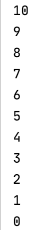

# [5️⃣ 코틀린의 반복문들]

[여기](https://kotlinlang.org/docs/tutorials/kotlin-for-py/loops.html) 참고하여 작성

## 1️⃣ 여러가지 for 문

* __for문 기본형__

    ~~~kotlin
    fun main() {
        val names = listOf<String>("Chohee", "Dahee", "Gahee")
        for(i in names) {
            println(i)
        }
    }
    ~~~

    코틀린의 for문은 위와 같이 __in__ 연산자를 사용하여 오른쪽에는 반복할 범위를 나타내고 왼쪽에는 반복의 결과인 각 인덱스별 데이터를 나타낸다.

    위와 같은 코드는 names 배열의 index 0 부터 끝까지 각 인덱스를 반복하여 해당 원소를 변수 i에 저장한다.

    출력 결과는 다음과 같다.

    

* __..연산자 사용하여 반복 범위를 나타내는 for 문__

    ~~~kotlin
    fun main() {
        for(i in 0..10) {
            println(i)
        }
    }
    ~~~

    코틀린 for문에서 in 연산자 오른쪽에는 반복할 범위를 나타낸다고 언급하였다.

    이 반복할 범위를 나타내는 방법으로 __..__ 연산자를 사용할 수 있다.

    위 코드처럼 0..10 이라고 반복 범위를 나타냈다면 인덱스 0에서부터 인덱스 10까지를 반복 범위로 한다는 뜻이다. (10이 포함됨을 주의하자!)

    따라서 출력결과는 다음과 같다.

    

    그렇다면 만약 반복 범위에 마지막 인덱스인 10을 포함하지 않고 싶다면? 바로 아래에 설명한 내용을 보자.

* __until 연산자를 사용하여 반복 범위를 나타내는 for 문__

    ~~~kotlin
    fun main() {
        for(i in 0 until 10) {
            println(i)
        }
    }
    ~~~

    반복할 범위를 나타낼 때 until 연산자를 사용할수도 있다.

    다만 until 연산자는 가장 마지막 인덱스를 포함하지 않고, 가장 마지막 인덱스 -1 까지만 포함한다는 것을 알고 사용해야 한다.
    
    위 코드처럼 0 until 10 이라고 반복할 범위를 나타냈다면 인덱스 0에서부터 인덱스 9까지를 반복 범위로 한다는 것이다.

    따라서 출력 결과는 다음과 같다.

    

* __downTo 연산자를 사용하여 반복 범위를 나타내는 for 문__

    ~~~kotlin
    fun main() {
        // 10 부터 0까지 내림차순으로 반복
        for(i in 10 downTo 0) {
            println(i)
        }
    }
    ~~~

    

* __[forEach](https://kotlinlang.org/api/latest/jvm/stdlib/kotlin.collections/for-each.html) 함수를 사용하여 반복하기__

    

    배열의 처음부터 끝까지에 있는 모든 원소에 접근하여 forEach() 괄호 안의 action을 수행할 때 사용한다.

    배열로써 문자열도 가능하고, 문자열일 경우 각 문자에 대해서 action을 수행한다.